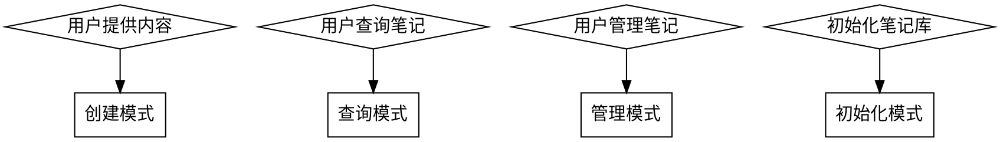
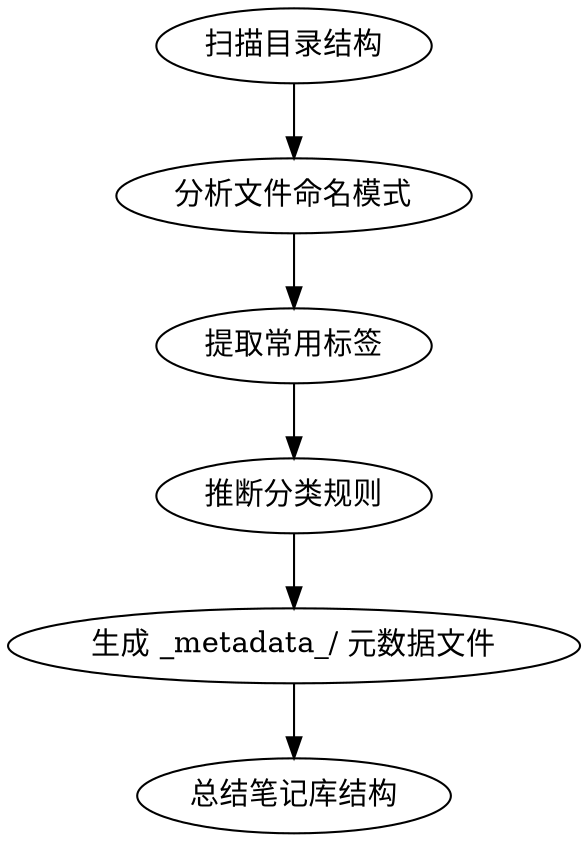
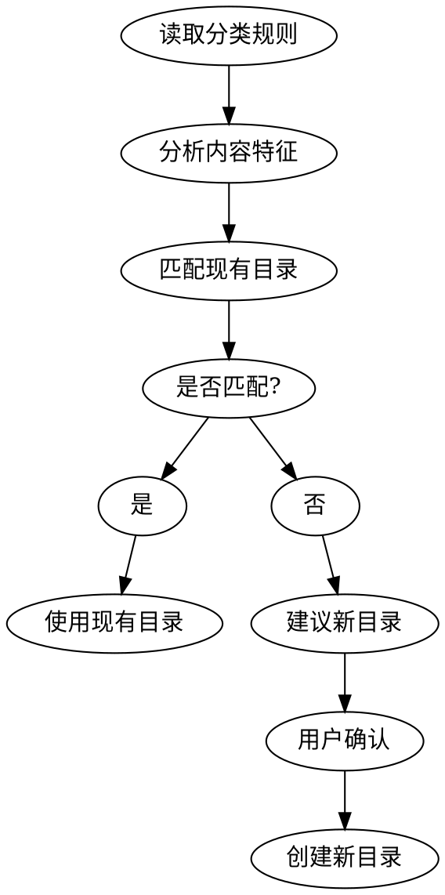

# Obsidian Note Workflow

## Overview

通用 Obsidian 笔记智能管理系统：预览优先 → 智能分类 → 自动创建 → 查询管理 → 库初始化。

**核心原则**：
- **快速优先**：确定的内容自动归类，不确定才预览
- **预览极简**：只显示目录+理由+候选文件名，不显示标签选项
- **优先更新**：检测相似文件，优先更新而非创建
- **两阶段加载**：预览读分类规则，确认后读标签规则
- **智能标签**：优先匹配现有标签，创建新标签后更新规则
- **历史追溯**：每次操作都记录到 history.md，支持查询
- **延迟生成**：确认后再生成标签、元数据
- **元数据分离**：分类、标签、命名规范、历史记录分开存储
- **原样记录用户内容，不主动扩展**
- 无需配置文件，智能分析

**智能推断**：通过分析现有目录和文件，自动识别分类规则、命名规范、标签体系。

## When to Use



**使用场景**：
- 用户提供会议、想法、待办等内容需要创建笔记
- 用户查询待办、标签、项目相关文档
- 用户标记完成、批量整理笔记
- **用户初始化现有笔记库**，生成分类规则和标签规则

---

## Mode 0: Initialize Vault (初始化模式) ⭐

### 初始化命令

当用户说"初始化我的笔记库"或"生成分类规则"时触发：



### Step 1: 扫描目录结构

**使用 Bash 工具扫描**：
```bash
# 查找所有一级目录
find . -maxdepth 1 -type d | grep -v "^\./\." | sort

# 查找所有二级目录
find . -maxdepth 2 -type d | grep -v "^\./\." | sort

# 统计每个目录的文件数量
for dir in */; do echo "$dir: $(find "$dir" -type f -name "*.md" | wc -l) files"; done
```

### Step 2: 分析文件命名模式

**提取命名规则**：
```bash
# 查看每个目录的文件命名模式
find ./00实时会议记录 -name "*.md" -type f | head -10
find ./01临时 -name "*.md" -type f | head -10
```

**识别模式**：
- 日期前缀：`YYYY-MM-DD-*`
- 客户前缀：`客户名-*`
- 类型后缀：`*-会议.md`

### Step 3: 提取常用标签

**从 frontmatter 提取**：
```bash
# 提取所有 tags 字段
grep -r "^tags:" --include="*.md" -A 5 | sort | uniq -c

# 统计标签使用频率
grep -rh "^tags:" --include="*.md" -A 5 | grep "^  -" | sort | uniq -c | sort -rn
```

### Step 4: 推断分类规则

**基于目录名称和文件内容推断**：

| 目录名 | 推断用途 | 典型文件模式 |
|-------|---------|-------------|
| `meetings/` `会议/` `00实时会议记录/` | 会议纪要 | `YYYY-MM-DD-*.md` |
| `temp/` `临时/` `01临时/` | 临时笔记 | `临时-*.md` `*.md` |
| `work/` `工作/` `03工作/` | 工作脚本 | `*.sh` `*.js` `脚本-*` |
| `clients/` `客户/` `04客户/` | 客户文档 | `客户名-*.md` |

### Step 5: 生成元数据文件

**在 `_metadata_/` 目录下生成多个元数据文件**：

#### `_metadata_/classification-rules.md`（分类规则 - 轻量级）
**用途**：预览阶段快速判断分类，文件小，加载快
**内容**：
- 每个目录的用途描述
- 关键词匹配规则
- 置信度判断标准

#### `_metadata_/tag-rules.md`（标签规则 - 重量级）
**用途**：确认后生成标签，文件可很大
**内容**：
- 完整的标签体系
- 标签推断规则
- 标签使用频率统计

#### `_metadata_/naming-conventions.md`（命名规范）
**用途**：确认后生成文件名
**内容**：
- 各类文档的命名规范
- 现有文件命名示例
- 最佳实践建议

#### `_metadata_/history.md`（操作历史）⭐
**用途**：记录所有操作历史，支持查询
**内容**：
- 按时间倒序排列的操作记录
- 每次操作的时间戳、类型、文件、概览
- 支持按次数、时间、类型、内容查询
- 持续追加，永不删除

### Step 6: 总结笔记库结构

**生成报告**：

```
🔍 笔记库分析报告
━━━━━━━━━━━━━━━━━━━━━━━━━━━━

📊 基本信息
- 总目录数: X 个
- 总文件数: Y 个
- 分析时间: YYYY-MM-DD

📂 目录结构
[一级目录列表，包含文件数统计]

🏷️ 标签体系
[按频率排序的常用标签]

📝 命名规范
[检测到的命名模式]

✅ 已完成
- 创建了 _metadata_/ 元数据文件夹
- 生成了分类规则文件（轻量，预览用）
- 生成了标签规则文件（重量，确认后用）
- 生成了命名规范文件
- 创建了操作历史文件（空文件，后续追加）

💡 后续使用
AI 将使用分离的元数据文件来加速预览和分类。
```

### 初始化元数据文件

**创建 `_metadata_/` 文件夹，并生成多个元数据文件**：

#### 1. `_metadata_/classification-rules.md`（分类规则）

```markdown
# 分类规则 - 用于预览阶段快速判断

**最后更新**: YYYY-MM-DD
**用途**: 轻量级分类规则，用于快速预览

## 目录分类规则

### 00实时会议记录/
- **用途**: 实时会议工作区
- **关键词**: 会议、录音、问答
- **置信度**: 90%（会议关键词）
- **典型文件**: 会议录音.md, 问答记录.md

### 01临时/
- **用途**: 临时笔记、快速想法
- **关键词**: 临时、测试、想法
- **置信度**: 90%（临时关键词）
- **典型文件**: 临时-*.md, 测试*.md

### 02提示词/
- **用途**: AI 工具提示词和配置
- **关键词**: 提示词、prompt、session
- **置信度**: 95%（明确类型）
- **典型文件**: *提示词.md

### 03工作/
- **用途**: 工作脚本、技术文档
- **关键词**: 脚本、插件、参数
- **置信度**: 90%（脚本关键词）
- **典型文件**: *脚本.md, *参数.md

### 04客户/
- **用途**: 客户项目文档
- **关键词**: 华为、OPPO、小天才、电信、飞速
- **置信度**: 95%（明确客户名）
- **典型文件**: [客户名]-*.md

## 置信度判断标准

- 95%: 明确客户名、明确类型（提示词、脚本）
- 90%: 明确关键词（临时、测试、会议）
- <90%: 需要预览确认
```

#### 2. `_metadata_/tag-rules.md`（标签规则）

```markdown
# 标签规则 - 用于确认后生成标签

**最后更新**: YYYY-MM-DD
**用途**: 完整标签体系和推断规则

## 标签分类

### 内容类型标签
- `#会议纪要` - 检测"会议"、"讨论" → 添加
- `#提示词` - 检测"提示词"、"prompt" → 添加
- `#脚本` - 检测"脚本"、"代码"、"函数" → 添加
- `#想法` - 检测"想法"、"突然想到" → 添加
- `#方案` - 检测"方案"、"解决" → 添加

### 状态标签
- `#进行中` - 正在进行的工作
- `#已完成` - 已完成的事项
- `#待验证` - 需要验证的内容

### 客户标签
- `#华为` - 检测"华为" → 添加
- `#OPPO` - 检测"OPPO"、"oppo" → 添加
- `#小天才` - 检测"小天才" → 添加
- `#电信` - 检测"电信" → 添加
- `#飞速` - 检测"飞速" → 添加

### 技术标签
- `#AI` - 检测"AI"、"智能" → 添加
- `#工具` - 检测"工具"、"软件" → 添加
- `#工作流` - 检测"工作流"、"流程" → 添加

## 标签组合规则

**会议记录**: `#会议纪要` + `#[客户名]`
**提示词**: `#提示词` + `#AI` + `#工具`
**脚本**: `#脚本` + `#工具`
**临时笔记**: `#想法`（仅此一个）
**客户方案**: `#方案` + `#[客户名]` + `#AI`
```

#### 3. `_metadata_/naming-conventions.md`（命名规范）

```markdown
# 命名规范 - 用于确认后生成文件名

**最后更新**: YYYY-MM-DD
**用途**: 文件命名规范和示例

## 各类文档命名规范

### 会议记录
**格式**: `YYYY-MM-DD-[客户]-会议类型.md`
**示例**: `2026-02-08-华为-AI平台讨论会议.md`

### 技术方案
**格式**: `[客户]-方案名称.md`
**示例**: `华为-AI平台升级方案.md`

### 提示词文档
**格式**: `[工具名称]-提示词-功能.md`
**示例**: `claudecode-提示词-会议记录.md`

### 脚本文档
**格式**: `[功能描述]-脚本.md`
**示例**: `自动分类-脚本.md`

### 临时笔记
**格式**: `临时-[主题]-YYYY-MM-DD.md`
**示例**: `临时-想法-20260208.md`

## 文件名规范
- ✅ 使用中英文、数字、连字符
- ❌ 不使用空格、特殊字符
- ✅ 日期格式: YYYY-MM-DD
- ✅ 客户名使用缓存中的标准名称
```

#### 4. `_metadata_/history.md`（操作历史）

```markdown
# 操作历史

**创建时间**: YYYY-MM-DD
**用途**: 记录所有创建和更新操作

---

## [YYYY-MM-DD HH:mm:ss]
**操作**: 初始化
**文件**: _metadata_/history.md
**概览**: 初始化笔记库，创建元数据文件

---
（后续操作将按时间倒序追加到此文件）
```

---

## Mode 1: Create Workflow (创建模式) ⚡

### 快速创建流程


### Step 1: 读取轻量元数据（预览阶段）

**读取两个轻量文件**（快速预览）：
1. 检查 `_metadata_/classification-rules.md` 是否存在
2. 检查 `_metadata_/naming-conventions.md` 是否存在
3. 如果不存在，自动运行初始化流程
4. **读取内容**：
   - `classification-rules.md`：目录分类规则、关键词、置信度
   - `naming-conventions.md`：命名规范（用于生成候选文件名）
5. **暂不读取** `tag-rules.md`（重量级文件，确认后读）

### Step 2: 内容识别 + 置信度判断 + 文件匹配

**基于缓存的分类规则**，识别内容并判断置信度。

**同时进行文件匹配**（优先更新现有文件）：
- 搜索目标目录中是否有相似文件
- 相似度判断：标题相似度、内容相似度、日期匹配
- 如果找到相似文件（≥70%相似度），建议更新
- 如果没有相似文件，建议创建新文件

**高置信度自动创建**（≥90%）：

| 匹配模式 | 目标目录 | 置信度 |
|---------|---------|-------|
| 明确客户名 + 会议 | `04客户/[客户]/会议/` | 95% |
| 包含"提示词" | `02提示词/` | 95% |
| 包含"脚本"、"函数" | `03工作/` | 90% |
| 包含"临时"、"测试" | `01临时/` | 90% |

**低置信度需要预览**（<90%）：

- 新客户名称（不确定是否创建子目录）
- 跨类别内容（同时匹配多个目录）
- 内容过短（少于10字）
- 无明显特征（无关键词匹配）

**重要原则**：
- ⚠️ **原样记录用户内容，不要主动扩展**
- ⚠️ **只整理格式，不添加额外内容**
- ⚠️ **如果需要补充内容，必须先征求用户同意**

### Step 3: 智能预览（创建 vs 更新）

**优先更新现有文件**：
- 搜索目标目录，检查是否有相似文件
- 相似度判断：标题相似度、内容主题、日期匹配
- 找到相似文件（≥70%）→ 建议更新
- 无相似文件 → 建议创建

**预览格式**：

```
📂 归类建议
━━━━━━━━━━━━━━━━━━━━━━━━━━━━

检测到相似文件: [是/否]

【方案1 - 更新现有】
文件: 04客户/华为/CodeBuddy工具优势.md
相似度: 85%
理由: 标题相似，内容主题匹配

【方案2 - 创建新文件】
文件名选项:
  1. CodeBuddy工具对比分析.md
  2. CodeBuddy功能特点.md
  3. AI工具-CodeBuddy优势.md

理由:
  • 包含工具功能对比分析
  • 匹配客户文档特征

请选择:
[u] 更新现有文件  [c] 创建新文件(选择1-3)  [n] 修改目录
```

**注意事项**：
- ✅ 优先建议更新现有文件（避免碎片化）
- ✅ 显示3个候选文件名供选择
- ✅ 相似度判断基于标题和内容
- ✅ 用户确认后才开始处理标签

### Step 4: 两阶段生成元数据 + 智能标签

**阶段1：用户确认后（或高置信度自动触发）**

1. **读取标签规则**（第二阶段加载）：
   - 读取 `_metadata_/tag-rules.md`
   - 读取 `_metadata_/naming-conventions.md`
   - **只在确认后才加载这些文件**（加速预览！）

2. **自动生成 frontmatter**：
   ```yaml
   ---
   title: [自动提取标题]
   date: [今天日期]
   tags:
     - [基于 tag-rules.md 推断3-5个标签]
   status: completed
   ---
   ```

3. **智能标签生成**（优先匹配现有标签）：

   **步骤1：读取现有标签**
   - 从 `_metadata_/tag-rules.md` 读取所有已有标签
   - 分析内容，提取关键词

   **步骤2：匹配现有标签**（优先）
   - 内容关键词与现有标签匹配
   - 客户名匹配 → `#客户名`
   - 内容类型匹配 → `#会议纪要`、`#提示词`、`#脚本` 等
   - 技术栈匹配 → `#AI`、`#工具` 等

   **步骤3：创建新标签**（仅当无法匹配时）
   - 如果现有标签无法满足（少于3个），创建新标签
   - 新标签命名规则：
     - 简洁明了（2-4个字）
     - 使用中文或英文
     - 避免重复和相似标签
   - **每个文件生成 3-10 个标签**

4. **调用 obsidian-markdown skill** 创建或更新笔记

### Step 5: 动态更新元数据文件 + 记录历史

**智能维护元数据体系**（确保后续分类准确）+ **记录操作历史**：

1. **检测需要更新的元数据**
   - 是否创建了新标签？
   - 是否创建了新目录？
   - 是否发现了新的命名模式？

2. **更新 tag-rules.md**（如果创建了新标签）
   - 将新标签添加到对应的分类中
   - 记录新标签的推断规则
   - 示例：
     ```markdown
     ## 内容类型标签
     - `#新标签` - 检测"关键词" → 添加
     ```

3. **更新 classification-rules.md**（如果创建了新目录）
   - 将新目录添加到分类规则中
   - 记录目录的用途、关键词、置信度
   - 示例：
     ```markdown
     ### 05新客户/
     - **用途**: 新客户项目文档
     - **关键词**: [客户名]
     - **置信度**: 95%（明确客户名）
     - **典型文件**: [客户名]-*.md
     ```

4. **更新 naming-conventions.md**（如果发现新命名模式）
   - 记录新发现的命名规律
   - 添加到对应的文档类型中
   - 示例：
     ```markdown
     ### 工具对比文档
     **格式**: [工具名]-对比-分析.md
     **示例**: CodeBuddy-对比-分析.md
     **检测时间**: YYYY-MM-DD
     ```

5. **无需更新的情况**
   - 所有标签、目录、命名模式都已存在
   - 只是更新现有文件内容

6. **记录操作历史**（每次操作都记录）
   - 追加到 `_metadata_/history.md`
   - 记录格式：
     ```markdown
     ## [YYYY-MM-DD HH:mm:ss]
     **操作**: [创建/更新]
     **文件**: [文件路径]
     **概览**: [一句话描述]
     **标签**: [新创建的标签，如有]
     **目录**: [新创建的目录，如有]
     ```
   - 用于后续查询历史记录

**元数据维护原则**：
- ✅ **动态更新**：创建新内容时自动维护元数据
- ✅ **持续优化**：每次操作都可能改进分类准确性
- ✅ **历史追踪**：所有操作都记录在 history.md
- ✅ **无需重新初始化**：元数据实时保持最新状态

---

## 自动创建置信度规则

### 高置信度场景（直接创建）

✅ **明确客户名**：检测到缓存中存在的客户名
✅ **明确类型**：提示词、脚本、会议
✅ **明确状态**：临时、测试、想法

### 低置信度场景（需要预览）

⚠️ **新客户名**：缓存中不存在的客户名
⚠️ **跨类别**：同时匹配多个目录特征
⚠️ **内容过短**：少于10个字符
⚠️ **模糊内容**：无明确关键词

### 特殊场景

🔧 **用户指定目录**：如果用户说"放到XX目录"，直接创建
🔧 **用户指定标题**：如果用户说"标题是XX"，使用用户指定的标题

---

## Mode 2: Query Functions (查询模式)

### 查询类型

| 查询类型 | 触发词示例 | 实现方法 |
|---------|-----------|---------|
| **待办查询** | "查询所有待办"、"列出任务" | 搜索 `- [ ]` 格式 |
| **状态查询** | "查看未完成的" | 搜索 task + status |
| **标签查询** | "列出标签为X的笔记" | Grep frontmatter tags |
| **目录查询** | "某目录下有哪些文档" | 搜索特定目录 |
| **时间查询** | "某月份的文档" | 搜索文件名日期 |
| **关键词搜索** | "搜索包含某词" | Grep 内容 |
| **历史查询** | "最近3次创建"、"最近5小时的操作" | 读取 `_metadata_/history.md` |

### 历史查询（新增）

**查询最近的操作记录**：

1. **按次数查询**
   - "最近3次创建的内容"
   - "最近5次修改"
   - "最近10次操作"
   - 实现：从 `_metadata_/history.md` 读取最后N条记录

2. **按时间查询**
   - "最近5小时创建的内容"
   - "今天创建的笔记"
   - "昨天修改的文件"
   - 实现：解析 history.md 的时间戳，筛选符合条件的记录

3. **按类型查询**
   - "最近创建的客户文档"
   - "最近更新的提示词文件"
   - 实现：结合 history.md 和文件路径筛选

4. **按内容查询**
   - "最近关于华为的记录"
   - "最近包含AI的笔记"
   - 实现：搜索 history.md 中的概览字段

**历史记录格式示例**：
```markdown
# 操作历史

## [2026-02-08 16:45:30]
**操作**: 创建
**文件**: 04客户/小客户X/会议纪要-20260208.md
**概览**: 小客户X项目启动会议
**标签**: #会议纪要 #小客户X #启动会
**目录**: 04客户/小客户X/

## [2026-02-08 15:20:10]
**操作**: 更新
**文件**: 02提示词/claudecode提示词.md
**概览**: 添加会议记录相关提示词

## [2026-02-08 14:30:25]
**操作**: 创建
**文件**: 04客户/华为/CodeBuddy工具优势.md
**概览**: CodeBuddy工具的功能特点记录
**标签**: #工具 #CodeBuddy

## [2026-02-08 11:15:00]
**操作**: 初始化
**文件**: _metadata_/history.md
**概览**: 初始化笔记库，创建元数据文件
```

**查询示例及响应**：

用户问："最近3次创建的内容"
AI 响应：
```
📋 最近3次创建的内容
━━━━━━━━━━━━━━━━━━━━━━━━━━━━

1. [2026-02-08 16:45] 小客户X/会议纪要-20260208.md
   小客户X项目启动会议

2. [2026-02-08 14:30] 华为/CodeBuddy工具优势.md
   CodeBuddy工具的功能特点记录

3. [2026-02-07 09:20] OPPO/AI平台升级方案.md
   OPPO智能体平台技术升级方案
```

用户问："最近5小时的操作"
AI 响应：
```
📋 最近5小时的操作（共5条）
━━━━━━━━━━━━━━━━━━━━━━━━━━━━

1. [16:45] 创建 - 小客户X/会议纪要-20260208.md
2. [15:20] 更新 - claudecode提示词.md
3. [14:30] 创建 - 华为/CodeBuddy工具优势.md
4. [13:10] 创建 - 临时-想法-20260208.md
5. [12:05] 更新 - 插件调用参数.md
```

用户问："今天关于华为的记录"
AI 响应：
```
📋 今天关于华为的记录（共2条）
━━━━━━━━━━━━━━━━━━━━━━━━━━━━

1. [14:30] 华为/CodeBuddy工具优势.md
   CodeBuddy工具的功能特点记录

2. [10:15] 华为/AI平台讨论会议.md
   华为AI平台技术讨论会议纪要
```

---

## Mode 3: Management (管理模式)

### 待办状态管理

- 标记完成：`- [ ]` → `- [x]`
- 批量操作：查询 → 选择 → 更新
- 更新 frontmatter `status` 字段

### 批量整理

- 整理临时目录
- 归档已完成项目
- 统一标签格式

---

## Intelligent Directory Matching (智能目录匹配)

### 匹配逻辑



### 智能推断

**基于已有目录模式推断新目录**：

- 检测到客户名 → 创建类似 `clients/[客户]/` 的目录
- 检测到新类型 → 询问用户或基于相似目录推断

---

## 元数据文件结构（`_metadata_/`）

### 文件分离设计 + 动态维护

**设计目标**：预览快！分阶段加载元数据 + 动态维护确保准确性 + 历史可追溯

| 文件 | 大小 | 加载时机 | 主要用途 | 何时更新 | 何时查询 |
|------|------|---------|---------|---------|---------|
| `_metadata_/classification-rules.md` | 小 | 预览阶段 | 快速判断分类 | 创建新目录时 | - |
| `_metadata_/naming-conventions.md` | 中 | 预览阶段 | 生成候选文件名 | 发现新命名模式时 | - |
| `_metadata_/tag-rules.md` | 大 | 确认后 | 生成标签 | 创建新标签时 | - |
| `_metadata_/history.md` | 增量增长 | 查询时 | 追溯操作历史 | 每次操作后 | 查询历史时 |

### 两阶段加载 + 历史记录

```
预览阶段:
  ↓
读取 classification-rules.md + naming-conventions.md（轻量）
  ↓
快速显示分类建议 + 候选文件名

用户确认后:
  ↓
读取 tag-rules.md（重量）
  ↓
生成完整元数据（标签）
  ↓
创建/更新笔记

动态维护:
  ↓
检测新标签、新目录、新命名模式
  ↓
自动更新对应的元数据文件
  ↓
追加操作历史到 history.md

历史查询:
  ↓
读取 history.md
  ↓
筛选符合条件的记录（次数/时间/类型/内容）
```

### 元数据文件说明

**classification-rules.md**（预览阶段读取 + 动态更新）
- **用途**：快速判断分类、目录匹配
- **读取时机**：预览阶段（第一）
- **更新时机**：创建新目录时
- **包含内容**：
  - 目录用途、关键词匹配
  - 置信度标准
  - 典型文件示例

**naming-conventions.md**（预览阶段读取 + 动态更新）
- **用途**：生成候选文件名（3个选项）
- **读取时机**：预览阶段（第二）
- **更新时机**：发现新命名模式时
- **包含内容**：
  - 各类文档命名规范
  - 现有文件示例
  - 最佳实践

**tag-rules.md**（确认后读取 + 动态更新）
- **用途**：生成3-10个标签
- **读取时机**：用户确认后（重量文件）
- **更新时机**：创建新标签时
- **包含内容**：
  - 完整标签体系（可很大）
  - 标签推断规则
  - 标签组合规则

**history.md**（查询时读取 + 每次操作追加）
- **用途**：追溯操作历史、查询历史记录
- **读取时机**：查询历史时
- **更新时机**：每次创建/更新笔记后追加
- **包含内容**：
  - 操作时间戳
  - 操作类型（创建/更新）
  - 文件路径
  - 一句话概览
  - 新标签（如有）
  - 新目录（如有）
- **查询维度**：
  - 按次数：最近N次操作
  - 按时间：最近N小时/天
  - 按类型：创建/更新
  - 按内容：关键词搜索概览

### 动态维护示例

**场景1：创建新客户目录**
```
用户输入: 小客户X的会议记录
  ↓
检测到新客户名（不在 classification-rules.md 中）
  ↓
创建目录: 04客户/小客户X/
  ↓
更新 classification-rules.md
  + ### 小客户X/
  +   - **用途**: 小客户X项目文档
  +   - **关键词**: 小客户X
  +   - **置信度**: 95%（明确客户名）
```

**场景2：发现新命名模式**
```
用户输入: CodeBuddy工具对比
  ↓
生成候选文件名时，发现"工具对比"是新类型
  ↓
更新 naming-conventions.md
  + ### 工具对比文档
  +   **格式**: [工具名]-对比-分析.md
  +   **示例**: CodeBuddy-对比-分析.md
  +   **检测时间**: 2026-02-08
```

**场景3：创建新标签**
```
用户输入: 低代码平台集成方案
  ↓
生成标签时，匹配不到"低代码"相关标签
  ↓
创建新标签: #低代码
  ↓
更新 tag-rules.md
  + ### 技术标签
  +   - `#低代码` - 检测"低代码"、"无代码" → 添加
```

---

## Reference: Obsidian Standards

### Frontmatter 格式

```yaml
---
title: 笔记标题
date: 2026-02-07
tags:
  - tag1
  - tag2
status: in-progress
priority: normal
aliases:
  - 备选名称
cssclasses:
  - custom-class
completed: false
due: 2026-02-15T14:30:00
---
```

### Tags 格式

**内联**: `#tag1 #tag2`
**Frontmatter**:
```yaml
tags:
  - tag1
  - tag2
```

**命名规则**：
- ✅ 字母（任何语言）、数字（非首位）、`_`、`-`、`/`
- ❌ 空格、特殊字符

### Task Lists

```markdown
- [ ] 未完成
- [x] 已完成
- [ ] 带子任务
  - [ ] 子任务1
```

### Wikilinks & Callouts

```markdown
[[笔记]]
[[笔记|显示文本]]
[[笔记#标题]]

> [!info] 信息
> [!warning] 警告
> [!tip]+ 折叠
```

---

## Required Dependency

**REQUIRED SUB-SKILL**: Must call `obsidian-markdown` for creating and editing notes.

**NEVER**:
- Use Write tool directly to create notes
- Create notes without proper Obsidian formatting
- 显示过多预览信息影响速度

**ALWAYS**:
- 高置信度内容自动创建
- 低置信度内容才预览，且预览极简
- **两阶段加载**：预览读 classification-rules.md，确认后读 tag-rules.md
- Call `obsidian-markdown` skill for note creation/editing
- Follow Obsidian Flavored Markdown standards
- Read `_metadata_/classification-rules.md` for 快速分类判断

---

## Common Mistakes

| 错误 | 后果 | 正确做法 |
|------|------|---------|
| 不初始化直接创建 | 无法智能分类 | 先运行"初始化笔记库" |
| 直接使用 Write 工具 | 格式不符合标准 | 调用 `obsidian-markdown` |
| 跳过预览直接创建 | 用户无法确认 | 严格遵循预览流程 |
| **主动扩展用户内容** | **偏离用户意图** | **原样记录，不主动扩展** |
| 在 frontmatter tags 中用 `#` | 格式错误 | `tags: [tag]` 不是 `tags: [#tag]` |
| 文件名包含特殊字符 | 文件系统问题 | 使用连字符替代 |

---

## Quick Reference

### 初始化检查清单
- [ ] 运行"初始化我的笔记库"命令
- [ ] 确认创建了 `_metadata_/` 文件夹
- [ ] 检查生成的 4 个元数据文件：
  - [ ] `_metadata_/classification-rules.md`（轻量）
  - [ ] `_metadata_/tag-rules.md`（重量）
  - [ ] `_metadata_/naming-conventions.md`（中等）
  - [ ] `_metadata_/history.md`（初始为空，后续追加）
- [ ] 验证推断的分类规则是否正确

### 创建笔记检查清单
- [ ] **阶段1**：读取 `_metadata_/classification-rules.md` + `naming-conventions.md`（轻量）
- [ ] 搜索目标目录，检测相似文件（优先更新）
- [ ] 内容识别 + 置信度判断
- [ ] 高置信度 → 直接创建/更新
- [ ] 低置信度 → 智能预览：
  - [ ] 显示相似文件检测结果
  - [ ] 显示3个候选文件名
  - [ ] 提供"更新"或"创建"选项
- [ ] **阶段2**：用户确认后读取 `tag-rules.md`
- [ ] 智能标签生成（3-10个）：
  - [ ] 优先匹配现有标签
  - [ ] 如无匹配，创建新标签
- [ ] 调用 `obsidian-markdown` 创建或更新
- [ ] **阶段3**：动态更新元数据（如果需要）：
  - [ ] 创建新标签？→ 更新 `tag-rules.md`
  - [ ] 创建新目录？→ 更新 `classification-rules.md`
  - [ ] 发现新命名模式？→ 更新 `naming-conventions.md`
- [ ] **阶段4**：记录操作历史（每次都记录）：
  - [ ] 追加到 `_metadata_/history.md`
  - [ ] 记录时间、操作类型、文件路径、概览
  - [ ] 记录新标签、新目录（如有）

### 查询操作速查
- 待办: `grep -r "^- \[ \]" --include="*.md"`
- 标签: `grep -r "tags:" --include="*.md" -A 3`
- 状态: `grep -r "status: in-progress" --include="*.md"`
- 最近3次操作: `head -30 _metadata_/history.md` （假设每条记录10行）
- 今天创建的: `grep "^## \[$(date +%Y-%m-%d)" _metadata_/history.md`
- 最近N小时: 解析时间戳后筛选

---

## Workflow Summary

### 初始化流程
```
用户: "初始化我的笔记库"
  ↓
扫描目录结构
  ↓
分析文件命名模式
  ↓
提取常用标签
  ↓
推断分类规则
  ↓
生成 _metadata_/ 元数据文件夹
  ├─ classification-rules.md（轻量）
  ├─ tag-rules.md（重量）
  ├─ naming-conventions.md（中等）
  └─ history.md（初始空文件，持续追加）
```

### 创建流程（快速模式 + 两阶段加载 + 动态维护 + 历史记录）
```
用户输入内容
  ↓
【阶段1】读取 classification-rules.md + naming-conventions.md（轻量）
  ↓
搜索相似文件（优先更新）
  ↓
内容识别 + 置信度判断
  ↓
┌─────────────┐
│ 高置信度?   │
└─────────────┘
  ↓ 是          ↓ 否
自动创建/更新    极简预览
  ↓             ↓
【阶段2】读取    用户确认
tag-rules.md     ↓
  ↓             ↓
生成3-10个标签  【阶段2】读取标签
  ↓             ↓
创建/更新笔记   生成标签
  ↓             ↓
【阶段3】动态    创建/更新
维护元数据      ↓
  ↓          【阶段3】动态
更新3个元数据    维护元数据
（如果需要）     （如果需要）
  ↓             ↓
【阶段4】记录    【阶段4】记录
操作历史        操作历史
  ↓             ↓
追加到          追加到
history.md      history.md
```

**关键设计原则**：
1. **快速优先**：确定的内容自动归类，不确定才预览
2. **预览极简**：只显示目录+理由+候选文件名
3. **优先更新**：检测相似文件，避免碎片化
4. **两阶段加载**：预览读轻量文件，确认后读重量文件
5. **智能标签**：优先匹配现有标签（3-10个）
6. **动态维护**：自动更新元数据文件（标签/目录/命名规则）
7. **历史追溯**：每次操作都记录，支持查询
8. **持续优化**：每次操作都改进后续分类准确性
9. **元数据分离**：分类、标签、命名规范、历史记录分开存储
10. **标准格式**：严格遵循 Obsidian 官方规范
11. **通用可复用**：适用于任何 Obsidian 笔记库
