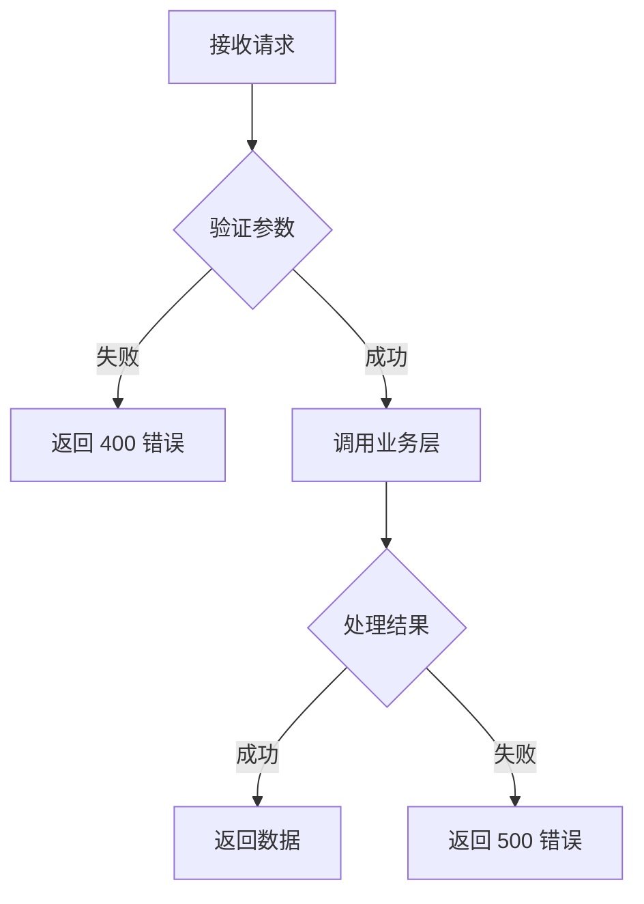

# 质量标准

## 必须包含的内容

- [ ] 至少 3 个核心业务流程分析
- [ ] 每个流程至少 2 个代码片段
- [ ] 所有代码片段标注文件路径和行号
- [ ] 至少 3 个 Mermaid 图表
- [ ] 完整的调用链追踪
- [ ] 环境变量清单

---

## 代码片段要求

| 项目 | 要求 |
|------|------|
| 长度 | 10-30 行 |
| 文件路径 | 必须标注完整路径 |
| 行号 | 必须标注行号范围（如 25-35） |
| 描述 | 必须有简短描述说明代码作用 |

**示例：**

**登录入口处理**
**文件：** `api/auth.py` (行 25-35)

```python
@router.post('/login')
async def login(request: LoginRequest):
    """处理用户登录请求"""
    user = await auth_service.authenticate(
        username=request.username,
        password=request.password
    )
    if not user:
        raise HTTPException(status_code=401, detail="认证失败")
    token = create_access_token(user.id)
    return {"token": token, "user": user.to_dict()}
```

---

## 流程图要求

| 项目 | 要求 |
|------|------|
| 语法 | 使用 Mermaid 语法 |
| 类型 | flowchart, sequenceDiagram, erDiagram, graph |
| 清晰度 | 清晰展示调用关系和数据流向 |
| 标注 | 标注关键节点和决策点 |

**示例：**



---

## 分析深度标准

### Quick 模式

- 3-4 个 subagent
- 2-3 分钟
- 基础结构和主要流程

### Standard 模式（默认）

- 5-6 个 subagent
- 5-8 分钟
- 完整流程分析 + 代码片段

### Deep 模式

- 7-8 个 subagent
- 10-15 分钟
- 深度调用链 + 异常处理分析

### UltraDeep 模式

- 9-10 个 subagent
- 20-30 分钟
- 全量分析 + 性能热点 + 安全分析

---

## 禁止事项

- ❌ 不输出没有文件路径的代码片段
- ❌ 不输出没有行号的代码引用
- ❌ 不使用纯文字描述代替流程图
- ❌ 不遗漏核心业务流程
- ❌ 不忽略敏感配置（必须标注）

---

## 检查清单

生成报告前，确认以下内容：

1. [ ] 所有 subagent 已完成分析
2. [ ] 代码片段都有路径和行号
3. [ ] 流程图使用 Mermaid 语法
4. [ ] 调用链完整可追踪
5. [ ] 敏感配置已标注
6. [ ] 报告文件已保存到正确位置
