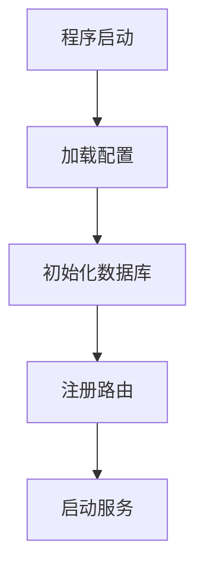
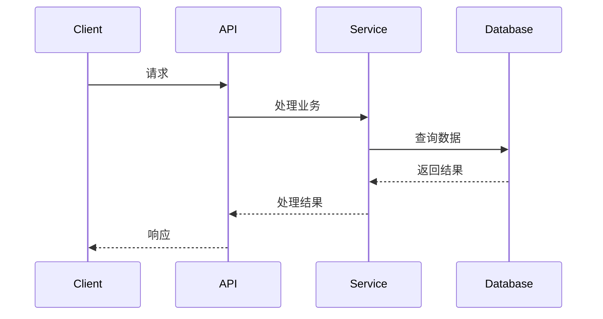
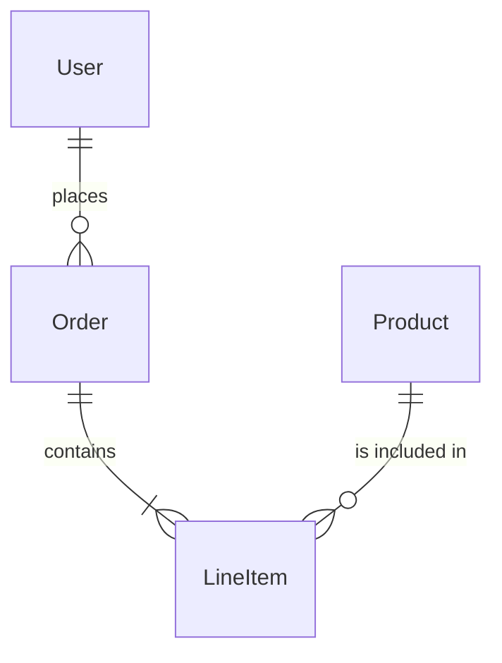
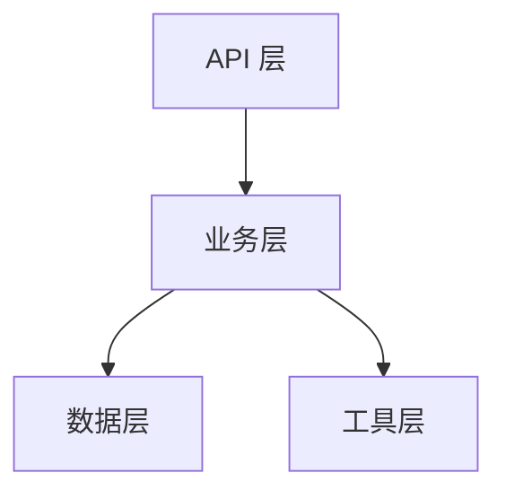

# 报告模板

## 报告结构

报告按以下章节渐进式生成，每个章节单独写入文件：

1. 报告头部和项目概览
2. 快速入手指南
3. 启动流程详解
4. 核心业务流程
5. 模块详解
6. 数据模型
7. 配置说明
8. 依赖分析
9. 总结

---

## 完整模板

```markdown
# {项目名称} 代码仓库深度分析报告

> 生成时间：{日期}
> 分析模式：{Quick/Standard/Deep/UltraDeep}

---

## 一、项目概览

### 1.1 项目简介

{一句话描述项目是做什么的}

### 1.2 技术栈

| 类别 | 技术 |
|------|------|
| 语言 | {主要编程语言} |
| 框架 | {使用的框架} |
| 数据库 | {数据库类型} |
| 其他 | {其他关键技术} |

### 1.3 项目结构

```
{目录树，标注核心目录}
```

---

## 二、快速入手指南

### 2.1 建议阅读顺序

作为一个新开发者，建议按以下顺序阅读代码：

| 步骤 | 文件 | 路径 | 目的 |
|------|------|------|------|
| 1 | 入口文件 | `{入口文件路径}` | 了解项目如何启动 |
| 2 | 配置文件 | `{配置文件路径}` | 了解配置项 |
| 3 | 核心模块1 | `{路径}` | {职责说明} |
| 4 | 核心模块2 | `{路径}` | {职责说明} |

### 2.2 本地运行

```bash
# 安装依赖
{安装命令}

# 配置环境变量
{配置说明}

# 启动项目
{启动命令}
```

---

## 三、启动流程详解

### 3.1 入口文件

**文件：** `{入口文件路径}`

**核心代码：**

```{language}
{入口文件关键代码片段，15-30 行}
```

### 3.2 启动流程图



### 3.3 启动步骤详解

| 步骤 | 描述 | 文件 | 行号 |
|------|------|------|------|
| 1 | 加载配置 | `app/config.py` | 15-20 |
| 2 | 初始化数据库 | `app/db/session.py` | 25-35 |
| ... | ... | ... | ... |

---

## 四、核心业务流程

### 4.1 {业务流程1名称}

**描述：** {一句话描述}

**入口：** `{文件路径}:{函数名}()` (行 {行号})

**流程图：**



**调用链：**

```
{文件1}:{函数1}() → {文件2}:{函数2}() → {文件3}:{函数3}()
```

**关键代码：**

**{代码片段1描述}**
**文件：** `{文件路径}` (行 {行号})

```{language}
{代码片段，10-20 行}
```

**{代码片段2描述}**
**文件：** `{文件路径}` (行 {行号})

```{language}
{代码片段，10-20 行}
```

### 4.2 {业务流程2名称}

{同上格式}

---

## 五、模块详解

### 5.1 {模块名称}

**位置：** `{文件路径}`

**职责：** {一句话描述}

**关键类/函数：**

| 名称 | 类型 | 描述 | 行号 |
|------|------|------|------|
| `{类名/函数名}` | class/function | {说明} | {行号} |

**核心代码：**

```{language}
{关键代码片段}
```

**依赖关系：**

- 依赖：`{依赖的模块}`
- 被依赖：`{被哪些模块使用}`

---

## 六、数据模型

### 6.1 模型关系图



### 6.2 模型详解

#### {模型名称}

**文件：** `{文件路径}` (行 {行号})

**描述：** {模型说明}

```{language}
{模型定义代码}
```

**字段说明：**

| 字段 | 类型 | 描述 |
|------|------|------|
| id | int | 主键 |
| name | str | 名称 |

---

## 七、配置说明

### 7.1 配置文件

| 文件 | 用途 | 格式 |
|------|------|------|
| `{文件名}` | {用途} | {格式} |

### 7.2 环境变量

| 变量名 | 必需 | 默认值 | 说明 |
|--------|------|--------|------|
| `{变量}` | 是/否 | {默认值} | {说明} |

### 7.3 配置加载

**文件：** `{文件路径}` (行 {行号})

```{language}
{配置加载代码}
```

---

## 八、依赖分析

### 8.1 外部依赖

| 依赖 | 版本 | 用途 | 类型 |
|------|------|------|------|
| {包名} | {版本} | {用途} | 生产/开发 |

### 8.2 内部依赖关系



---

## 九、总结

### 9.1 项目特点

{整体评价}

### 9.2 学习建议

{学习建议}
```

---

## 输出文件

- **文件名**：`repo-analysis-YYYYMMDD.md`
- **位置**：`<项目根目录>/docs/`
- **临时文件**：`<项目根目录>/docs/analysis-temp/`
