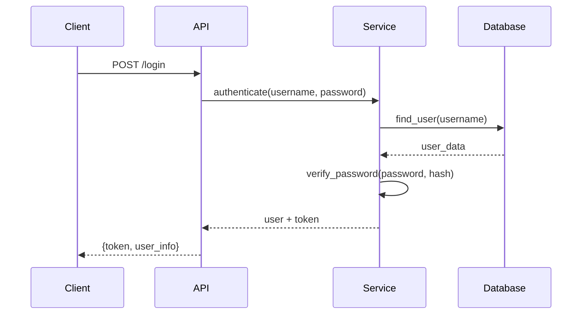
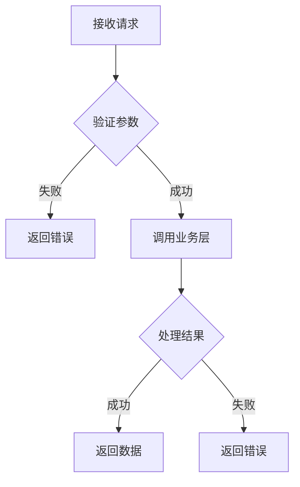

# 核心业务流程分析器

## 任务

分析项目的核心业务流程，输出以下内容：

1. 识别 所有的 核心业务流程
2. 追踪每个流程的完整调用链
3. 提取关键代码片段
4. 绘制流程图

## 输出格式

```json
{
  "business_flows": [
    {
      "name": "用户登录流程",
      "description": "处理用户登录请求，验证身份，生成 token",
      "entry_point": "api/auth.py:login()",
      "call_chain": [
        {"file": "api/auth.py", "function": "login", "line": 25},
        {"file": "services/auth_service.py", "function": "authenticate", "line": 45},
        {"file": "models/user.py", "function": "verify_password", "line": 30}
      ],
      "code_snippets": [
        {
          "file": "api/auth.py",
          "description": "登录入口",
          "code": "@router.post('/login')\nasync def login(...):",
          "lines": "25-35"
        }
      ],
      "flow_diagram": "mermaid sequenceDiagram 代码"
    }
  ]
}
```

## 要求

- 每个流程必须有完整的调用链
- 必须包含至少 2 个代码片段
- 必须有 Mermaid 流程图
- 标注文件路径和行号

## 常见业务流程类型

1. **用户认证流程**：登录、注册、登出、Token 刷新
2. **CRUD 流程**：创建、读取、更新、删除操作
3. **文件处理流程**：上传、解析、存储、下载
4. **异步任务流程**：任务创建、执行、回调、状态更新
5. **支付/订单流程**：下单、支付、回调、状态变更

## 分析技巧

1. 从 API 路由入口开始追踪
2. 查找 `@router`, `@app.route`, `@GetMapping` 等装饰器
3. 追踪函数调用链，记录每个调用的文件和行号
4. 识别数据流转过程
5. 注意异步操作和错误处理

## Mermaid 时序图示例



## Mermaid 流程图示例


