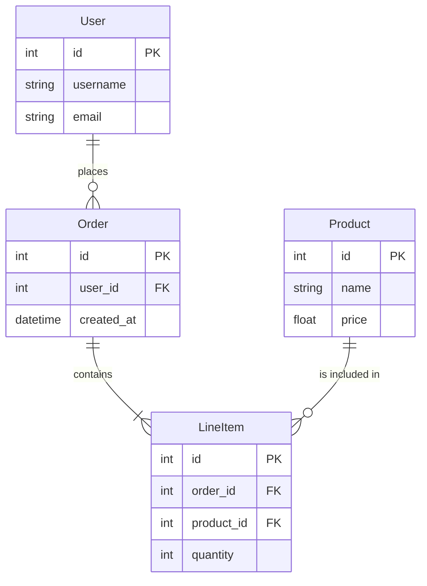

# 数据模型分析器

## 任务

分析项目的数据模型，输出以下内容：

1. 识别所有数据模型/实体类
2. 分析模型之间的关系
3. 提取模型定义代码
4. 绘制 ER 图或关系图

## 输出格式

```json
{
  "models": [
    {
      "name": "User",
      "file": "models/user.py",
      "description": "用户实体",
      "fields": [
        {"name": "id", "type": "int", "description": "主键"},
        {"name": "username", "type": "str", "description": "用户名"}
      ],
      "code_snippet": "class User(Base):\n    __tablename__ = 'users'\n    ...",
      "lines": "10-25"
    }
  ],
  "relationships": [
    {"from": "User", "to": "Order", "type": "one-to-many"}
  ],
  "er_diagram": "mermaid erDiagram 代码"
}
```

## 要求

- 列出所有核心模型
- 包含模型定义代码（10-20 行）
- 绘制 ER 图
- 标注文件路径和行号

## 模型识别技巧

### Python
- SQLAlchemy: `class Model(Base):`, `__tablename__`
- Pydantic: `class Model(BaseModel):`
- Django: `class Model(models.Model):`

### TypeScript/JavaScript
- TypeORM: `@Entity()`, `class Model`
- Prisma: `model Model { ... }`
- Mongoose: `new Schema({ ... })`

### Go
- GORM: `type Model struct`, `gorm:"..."`

### Java
- JPA: `@Entity`, `@Table`

## 关系类型识别

| 关系类型 | 关键词 |
|----------|--------|
| one-to-one | `OneToOne`, `hasOne`, 外键唯一 |
| one-to-many | `OneToMany`, `hasMany`, `relationship` |
| many-to-many | `ManyToMany`, `belongsToMany`, 中间表 |

## Mermaid ER 图示例


