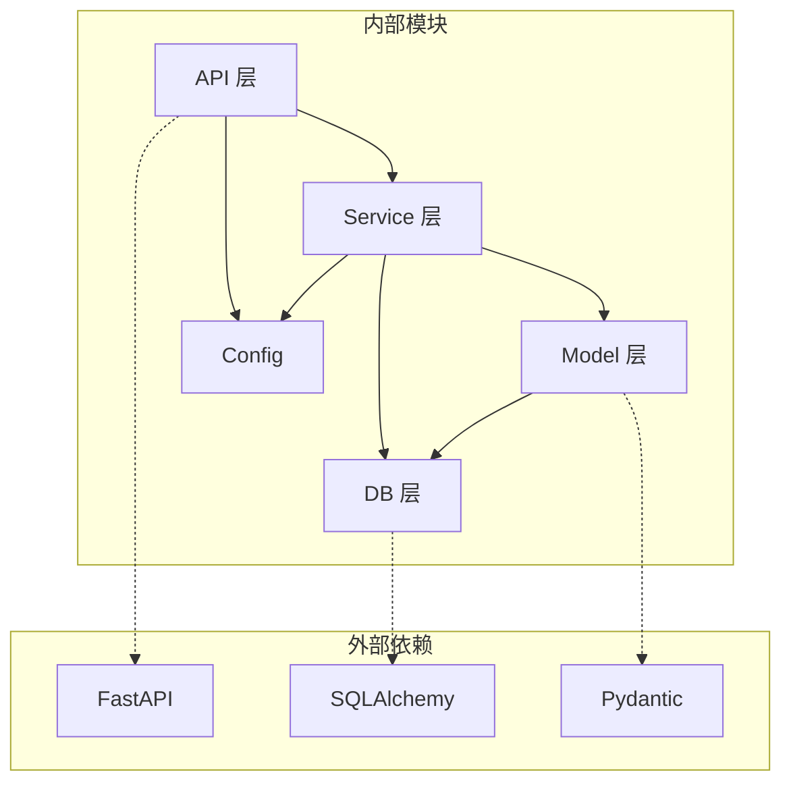

# 依赖关系分析器

## 任务

分析项目的依赖关系，输出以下内容：

1. 分析外部依赖（第三方库）
2. 分析内部模块依赖
3. 识别关键依赖和可选依赖
4. 绘制依赖关系图

## 输出格式

```json
{
  "external_dependencies": {
    "production": [
      {"name": "fastapi", "version": "0.100.0", "purpose": "Web 框架"},
      {"name": "sqlalchemy", "version": "2.0.0", "purpose": "ORM"}
    ],
    "development": [
      {"name": "pytest", "version": "7.0.0", "purpose": "测试框架"}
    ]
  },
  "internal_dependencies": {
    "api -> services": "API 层调用业务逻辑层",
    "services -> models": "业务逻辑层访问数据模型"
  },
  "dependency_diagram": "mermaid graph 代码"
}
```

## 要求

- 区分生产依赖和开发依赖
- 说明每个依赖的用途
- 绘制内部模块依赖图

## 依赖文件识别

| 语言 | 依赖文件 | 锁文件 |
|------|----------|--------|
| Python | `requirements.txt`, `pyproject.toml` | `poetry.lock`, `Pipfile.lock` |
| Node.js | `package.json` | `package-lock.json`, `yarn.lock` |
| Go | `go.mod` | `go.sum` |
| Rust | `Cargo.toml` | `Cargo.lock` |
| Java | `pom.xml`, `build.gradle` | - |

## 内部依赖分析技巧

1. 使用 `import`, `require`, `use` 语句识别模块依赖
2. 分析目录结构，理解分层架构
3. 识别循环依赖问题

## 常见分层架构依赖

```
API 层 → Service 层 → Model 层
                    ↘ Utils 层
```

## Mermaid 依赖图示例


