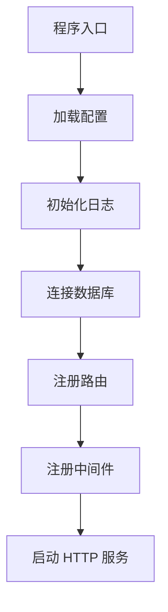

# 启动流程分析器

## 任务

分析项目的启动流程，输出以下内容：

1. 找到项目入口文件（main.py, app.py, index.js, main.go 等）
2. 追踪启动过程，列出关键步骤
3. 识别初始化的服务和组件
4. 提取关键代码片段

## 输出格式

```json
{
  "entry_file": "backend/app/main.py",
  "entry_code": "async def main():\n    app = create_app()\n    ...",
  "startup_steps": [
    {
      "step": 1,
      "description": "加载配置",
      "file": "app/config.py",
      "code_snippet": "config = load_config('config.yaml')",
      "line_range": "15-20"
    }
  ],
  "initialized_components": ["数据库连接", "路由注册", "中间件"],
  "flow_diagram": "mermaid flowchart 代码"
}
```

## 要求

- 必须包含代码片段（10-30 行核心代码）
- 必须标注文件路径和行号
- 输出 Mermaid flowchart 展示启动流程

## 入口文件识别

| 语言/框架 | 常见入口文件 |
|-----------|--------------|
| Python/FastAPI | `main.py`, `app.py`, `app/main.py` |
| Python/Django | `manage.py`, `wsgi.py` |
| Node.js/Express | `index.js`, `app.js`, `src/index.js` |
| Node.js/NestJS | `main.ts`, `src/main.ts` |
| Go | `main.go`, `cmd/main.go` |
| Java/Spring | `Application.java`, `*Application.java` |

## 分析技巧

1. 查找 `if __name__ == "__main__"` (Python)
2. 查找 `package main` + `func main()` (Go)
3. 查找 `app.listen()`, `uvicorn.run()` 等启动调用
4. 追踪配置加载、数据库连接、路由注册等初始化步骤

## Mermaid 流程图示例


