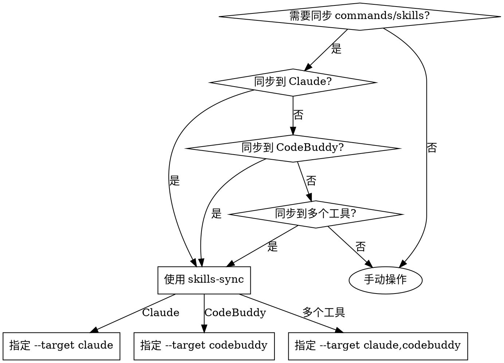

# Skills Sync

## 概述

将 `~/.agents/commands/` 和 `~/.agents/skills/` 通过软链接同步到各种 AI 工具目录，实现跨工具的命令和技能共享。

支持同步**文件和目录**：
- **Commands**：同步 `.md` 命令文件和命令目录
- **Skills**：同步 skill 目录和相关文件

## 核心原则

- **软链接而非拷贝**：使用符号链接避免重复维护
- **智能跳过**：已存在的有效链接不会被重新创建
- **自动清理**：删除指向不存在目标的无效软链接
- **跨平台支持**：Python 实现，支持 macOS/Linux/Windows

## 何时使用



**使用场景：**
- 在 `~/.agents/` 中添加新的 command 或 skill 后，需要同步到 Claude
- 更新 skill 后，需要确保所有工具使用最新版本
- 多个 AI 工具需要共享同一套 commands 和 skills
- 清理无效的软链接

**不适用于：**
- 需要为不同工具维护不同版本的命令
- 拷贝文件而非创建软链接

## 快速参考

| 目标 | 命令 |
|------|------|
| 同步 commands 到 Claude | `uv run --directory ~/.agents/skills/skills-sync python sync.py --target claude --type commands` |
| 同步 skills 到 Claude | `uv run --directory ~/.agents/skills/skills-sync python sync.py --target claude --type skills` |
| 同步两者到 Claude | `uv run --directory ~/.agents/skills/skills-sync python sync.py --target claude --type both` |
| 同步两者到 CodeBuddy | `uv run --directory ~/.agents/skills/skills-sync python sync.py --target codebuddy --type both` |
| 同步两者到多个工具 | `uv run --directory ~/.agents/skills/skills-sync python sync.py --target claude,codebuddy --type both` |

## 目标路径

| 工具 | Commands 路径 | Skills 路径 |
|------|---------------|-------------|
| Claude | `~/.claude/commands/` | `~/.claude/skills/` |
| CodeBuddy | `~/.codebuddy/commands/` | `~/.codebuddy/skills/` |

## 实现

脚本位于：`~/.agents/skills/skills-sync/sync.py`

### 功能特性

1. **支持文件和目录**：同步 `.md` 命令文件和命令/技能目录
2. **智能创建**：仅创建不存在的软链接
3. **有效性检查**：验证现有软链接是否指向存在的目标
4. **自动清理**：删除指向不存在目标的无效软链接
5. **批量同步**：支持同时同步到多个工具（逗号分隔）
6. **选择性同步**：可选择仅同步 commands、skills 或两者
7. **隐藏文件过滤**：自动跳过 `.DS_Store` 等隐藏文件

### 输出符号说明

- `✓` - 成功操作
- `⚠` - 跳过（目标已存在且不是软链接）
- `✗` - 错误或删除无效链接

## 常见错误

| 错误 | 原因 | 解决方法 |
|------|------|---------|
| `源目录不存在` | `~/.agents/commands/` 或 `~/.agents/skills/` 不存在 | 创建相应的源目录 |
| `创建失败` | 权限不足或目标路径冲突 | 检查目标目录权限 |
| `目标已存在且不是软链接` | 目标位置有同名文件/目录 | 手动删除或重命名目标 |
| `未知的目标工具` | 拼写错误或不支持的工具 | 检查 `--target` 参数 |

## 实际应用

**典型工作流：**

```bash
# 1. 在 ~/.agents/ 中创建新 skill
mkdir -p ~/.agents/skills/my-skill
echo "..." > ~/.agents/skills/my-skill/SKILL.md

# 2. 同步到 Claude
uv run --directory ~/.agents/skills/skills-sync python sync.py --target claude --type skills

# 3. 同步到 CodeBuddy
uv run --directory ~/.agents/skills/skills-sync python sync.py --target codebuddy --type skills

# 或一次性同步到两者
uv run --directory ~/.agents/skills/skills-sync python sync.py --target claude,codebuddy --type skills
```

**清理无效链接：**

```bash
# 运行同步会自动清理无效链接
uv run --directory ~/.agents/skills/skills-sync python sync.py --target claude --type both
```
